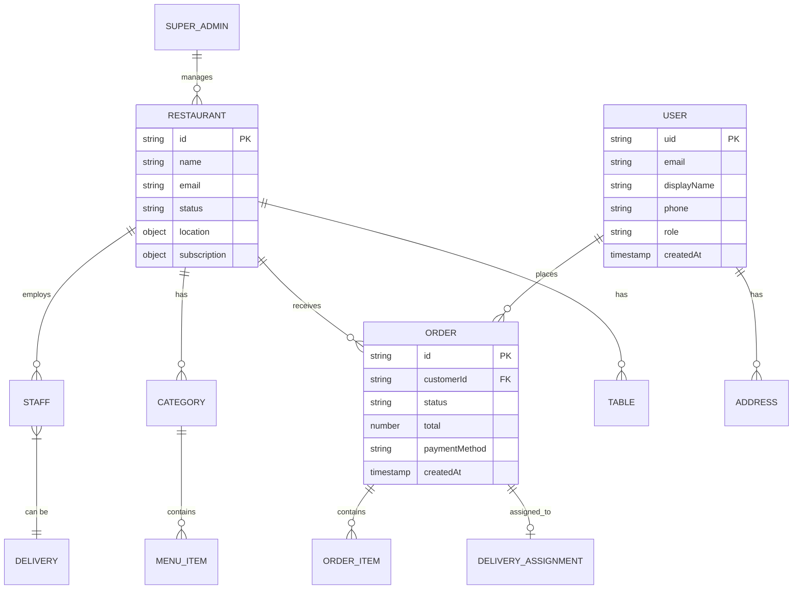

# 🗄️ Firestore Database Structure

## Multi-Tenant Architecture Overview

```
📦 Firestore (Single Database - Multi-Tenant)
├── 📁 users/                    → Global customer accounts
├── 📁 restaurants/              → Multi-tenant restaurant data
├── 📁 superAdmins/              → Platform administrators
└── 📁 saas/                     → Platform configuration
```

---

## 🔷 Entity Relationship Diagram



---

## 📁 Collection: `users`

> **Path**: `/users/{userId}`  
> **Description**: Global customer accounts (can order from any restaurant)

```typescript
interface User {
  uid: string;                    // Firebase Auth UID
  email: string;                  // User email
  displayName: string;            // Full name
  phone?: string;                 // Phone number
  photoURL?: string;              // Profile picture URL
  role: 'CUSTOMER';               // Always CUSTOMER for this collection
  authProvider: 'google' | 'email' | 'phone';
  theme: 'light' | 'dark';        // User preference
  createdAt: Timestamp;
  updatedAt: Timestamp;
  lastLoginAt: Timestamp;
  status: 'ACTIVE' | 'SUSPENDED';
}
```

### Subcollection: `users/{userId}/addresses`

```typescript
interface Address {
  id: string;
  label: string;                  // "Home", "Work", "Other"
  addressLine1: string;
  addressLine2?: string;
  city: string;
  state: string;
  pincode: string;
  landmark?: string;
  location: {
    latitude: number;
    longitude: number;
  };
  isDefault: boolean;
  createdAt: Timestamp;
}
```

---

## 📁 Collection: `restaurants`

> **Path**: `/restaurants/{restaurantId}`  
> **Description**: Core tenant data - each restaurant is a tenant

```typescript
interface Restaurant {
  id: string;
  name: string;
  slug: string;                   // URL-friendly name
  email: string;                  // Primary contact
  phone: string;
  description?: string;
  
  // Location
  address: {
    line1: string;
    line2?: string;
    city: string;
    state: string;
    pincode: string;
    location: {
      latitude: number;
      longitude: number;
    };
  };
  
  // Operations
  status: 'ACTIVE' | 'SUSPENDED' | 'PENDING';
  isOnline: boolean;              // Currently accepting orders
  operatingHours: {
    [day: string]: {              // 'monday', 'tuesday', etc.
      isOpen: boolean;
      openTime: string;           // "09:00"
      closeTime: string;          // "22:00"
    };
  };
  
  // Delivery Settings
  deliveryEnabled: boolean;
  deliveryRadius: number;         // in km
  deliveryFee: number;
  minOrderAmount: number;
  averageDeliveryTime: number;    // in minutes
  
  // Branding
  logo?: string;                  // Storage URL
  banner?: string;                // Storage URL
  primaryColor?: string;          // Hex color
  
  // Subscription
  subscriptionPlanId: string;
  subscriptionStatus: 'ACTIVE' | 'EXPIRED' | 'TRIAL';
  subscriptionExpiresAt: Timestamp;
  
  // Metadata
  createdAt: Timestamp;
  updatedAt: Timestamp;
  createdBy: string;              // Super Admin UID
}
```

---

### Subcollection: `restaurants/{restaurantId}/staff`

> **Path**: `/restaurants/{restaurantId}/staff/{staffId}`

```typescript
interface Staff {
  uid: string;                    // Firebase Auth UID
  email: string;
  displayName: string;
  phone: string;
  photoURL?: string;
  
  role: 'RESTAURANT_ADMIN' | 'RESTAURANT_STAFF' | 'DELIVERY_PERSONNEL';
  
  // Delivery Personnel Specific
  isDelivery: boolean;
  isOnline?: boolean;             // For delivery staff
  vehicleType?: 'BIKE' | 'SCOOTER' | 'CAR';
  vehicleNumber?: string;
  currentLocation?: {
    latitude: number;
    longitude: number;
    updatedAt: Timestamp;
  };
  
  // Stats
  totalDeliveries?: number;
  totalEarnings?: number;
  rating?: number;
  
  status: 'ACTIVE' | 'SUSPENDED';
  createdAt: Timestamp;
  updatedAt: Timestamp;
}
```

---

### Subcollection: `restaurants/{restaurantId}/categories`

> **Path**: `/restaurants/{restaurantId}/categories/{categoryId}`

```typescript
interface Category {
  id: string;
  name: string;
  description?: string;
  image?: string;
  sortOrder: number;
  isActive: boolean;
  createdAt: Timestamp;
  updatedAt: Timestamp;
}
```

---

### Subcollection: `restaurants/{restaurantId}/menuItems`

> **Path**: `/restaurants/{restaurantId}/menuItems/{itemId}`

```typescript
interface MenuItem {
  id: string;
  categoryId: string;             // Reference to category
  name: string;
  description?: string;
  price: number;
  discountedPrice?: number;
  image?: string;
  
  // Dietary Info
  isVeg: boolean;
  isVegan?: boolean;
  isGlutenFree?: boolean;
  spiceLevel?: 'MILD' | 'MEDIUM' | 'HOT';
  
  // Customizations
  customizations?: {
    name: string;                 // "Size", "Toppings"
    required: boolean;
    maxSelections?: number;
    options: {
      name: string;
      price: number;              // Additional price
    }[];
  }[];
  
  // Availability
  isAvailable: boolean;
  availableFrom?: string;         // Time e.g., "18:00"
  availableTo?: string;           // Time e.g., "23:00"
  
  sortOrder: number;
  tags?: string[];                // "bestseller", "new", "spicy"
  createdAt: Timestamp;
  updatedAt: Timestamp;
}
```

---

### Subcollection: `restaurants/{restaurantId}/orders`

> **Path**: `/restaurants/{restaurantId}/orders/{orderId}`

```typescript
interface Order {
  id: string;
  orderNumber: string;            // Human-readable e.g., "ORD-001234"
  
  // Customer Info
  customerId: string;             // User UID
  customerName: string;
  customerPhone: string;
  customerEmail?: string;
  
  // Order Type
  orderType: 'DELIVERY' | 'DINE_IN' | 'TAKEAWAY';
  tableNumber?: string;           // For dine-in
  
  // Items
  items: {
    menuItemId: string;
    name: string;
    quantity: number;
    unitPrice: number;
    totalPrice: number;
    customizations?: {
      name: string;
      option: string;
      price: number;
    }[];
    specialInstructions?: string;
  }[];
  
  // Pricing
  subtotal: number;
  taxAmount: number;
  deliveryFee: number;
  discount: number;
  total: number;
  
  // Payment
  paymentMethod: 'COD' | 'ONLINE_UPI' | 'CARD' | 'CASHIER';
  paymentStatus: 'PENDING' | 'PAID' | 'FAILED' | 'REFUNDED';
  paymentId?: string;             // Gateway transaction ID
  
  // Delivery Address
  deliveryAddress?: {
    addressLine1: string;
    addressLine2?: string;
    city: string;
    pincode: string;
    landmark?: string;
    location: {
      latitude: number;
      longitude: number;
    };
  };
  
  // Status Flow
  status: 'PENDING' | 'ACCEPTED' | 'PREPARING' | 'READY' | 
          'PICKED_UP' | 'OUT_FOR_DELIVERY' | 'DELIVERED' | 
          'CANCELLED' | 'REJECTED';
  
  statusHistory: {
    status: string;
    timestamp: Timestamp;
    note?: string;
    updatedBy?: string;
  }[];
  
  // Delivery Assignment
  assignedDriverId?: string;
  driverName?: string;
  driverPhone?: string;
  driverRejectionReason?: string;
  
  // Timing
  estimatedDeliveryTime?: Timestamp;
  actualDeliveryTime?: Timestamp;
  
  // Review
  rating?: number;
  review?: string;
  
  createdAt: Timestamp;
  updatedAt: Timestamp;
}
```

---

### Subcollection: `restaurants/{restaurantId}/carts`

> **Path**: `/restaurants/{restaurantId}/carts/{cartId}`

```typescript
interface Cart {
  id: string;                     // Can be sessionId or userId
  userId?: string;                // If authenticated
  sessionId?: string;             // For guest users
  
  items: {
    menuItemId: string;
    name: string;
    quantity: number;
    unitPrice: number;
    customizations?: {
      name: string;
      option: string;
      price: number;
    }[];
  }[];
  
  subtotal: number;
  createdAt: Timestamp;
  updatedAt: Timestamp;
  expiresAt: Timestamp;           // Auto-cleanup
}
```

---

### Subcollection: `restaurants/{restaurantId}/tables`

> **Path**: `/restaurants/{restaurantId}/tables/{tableId}`

```typescript
interface Table {
  id: string;
  tableNumber: string;
  capacity: number;
  qrCode: string;                 // QR code data/URL
  status: 'AVAILABLE' | 'OCCUPIED' | 'RESERVED';
  currentOrderId?: string;
  createdAt: Timestamp;
}
```

---

### Subcollection: `restaurants/{restaurantId}/analytics`

> **Path**: `/restaurants/{restaurantId}/analytics/{date}`

```typescript
interface DailyAnalytics {
  date: string;                   // "2026-01-05"
  
  // Orders
  totalOrders: number;
  onlineOrders: number;
  offlineOrders: number;
  cancelledOrders: number;
  
  // Revenue
  totalRevenue: number;
  onlineRevenue: number;
  cashRevenue: number;
  deliveryFeeCollected: number;
  
  // Items
  itemsSold: number;
  topItems: {
    itemId: string;
    name: string;
    quantity: number;
    revenue: number;
  }[];
  
  // Performance
  averageOrderValue: number;
  averageDeliveryTime: number;
  averageRating: number;
  
  updatedAt: Timestamp;
}
```

---

## 📁 Collection: `superAdmins`

> **Path**: `/superAdmins/{adminId}`

```typescript
interface SuperAdmin {
  uid: string;
  email: string;
  displayName: string;
  role: 'SUPER_ADMIN';
  permissions: string[];          // Granular permissions
  createdAt: Timestamp;
  lastLoginAt: Timestamp;
}
```

---

## 📁 Collection: `saas`

> **Path**: `/saas/{docId}`

### Document: `saas/config`

```typescript
interface SaasConfig {
  platformName: string;
  platformCommission: number;     // Percentage per order
  supportEmail: string;
  supportPhone: string;
  termsUrl: string;
  privacyUrl: string;
  updatedAt: Timestamp;
}
```

### Document: `saas/plans`

```typescript
interface SubscriptionPlans {
  plans: {
    id: string;
    name: string;                 // "Basic", "Pro", "Enterprise"
    price: number;
    billingCycle: 'MONTHLY' | 'YEARLY';
    features: string[];
    maxMenuItems: number;
    maxStaff: number;
    analyticsEnabled: boolean;
    prioritySupport: boolean;
  }[];
  updatedAt: Timestamp;
}
```

---

## 🔐 Firebase Auth Custom Claims

```typescript
// Set via Cloud Functions on user creation/update
interface CustomClaims {
  role: 'CUSTOMER' | 'RESTAURANT_ADMIN' | 'RESTAURANT_STAFF' | 
        'DELIVERY_PERSONNEL' | 'SUPER_ADMIN';
  restaurantId?: string;          // For restaurant staff/admin
}
```

---

## 📊 Recommended Indexes

```javascript
// firestore.indexes.json
{
  "indexes": [
    // Orders by restaurant and status
    {
      "collectionGroup": "orders",
      "fields": [
        { "fieldPath": "status", "order": "ASCENDING" },
        { "fieldPath": "createdAt", "order": "DESCENDING" }
      ]
    },
    // Orders by customer
    {
      "collectionGroup": "orders",
      "fields": [
        { "fieldPath": "customerId", "order": "ASCENDING" },
        { "fieldPath": "createdAt", "order": "DESCENDING" }
      ]
    },
    // Staff by role and status
    {
      "collectionGroup": "staff",
      "fields": [
        { "fieldPath": "role", "order": "ASCENDING" },
        { "fieldPath": "isOnline", "order": "ASCENDING" }
      ]
    },
    // Menu items by category
    {
      "collectionGroup": "menuItems",
      "fields": [
        { "fieldPath": "categoryId", "order": "ASCENDING" },
        { "fieldPath": "sortOrder", "order": "ASCENDING" }
      ]
    }
  ]
}
```

---

## 🗂️ Complete Structure Tree

```
📦 Firestore
│
├── 📁 users/{userId}
│   ├── 📄 User document
│   └── 📁 addresses/{addressId}
│       └── 📄 Address document
│
├── 📁 restaurants/{restaurantId}
│   ├── 📄 Restaurant document
│   │
│   ├── 📁 staff/{staffId}
│   │   └── 📄 Staff/Driver document
│   │
│   ├── 📁 categories/{categoryId}
│   │   └── 📄 Category document
│   │
│   ├── 📁 menuItems/{itemId}
│   │   └── 📄 MenuItem document
│   │
│   ├── 📁 orders/{orderId}
│   │   └── 📄 Order document
│   │
│   ├── 📁 carts/{cartId}
│   │   └── 📄 Cart document
│   │
│   ├── 📁 tables/{tableId}
│   │   └── 📄 Table document
│   │
│   └── 📁 analytics/{date}
│       └── 📄 DailyAnalytics document
│
├── 📁 superAdmins/{adminId}
│   └── 📄 SuperAdmin document
│
└── 📁 saas/
    ├── 📄 config
    └── 📄 plans
```
