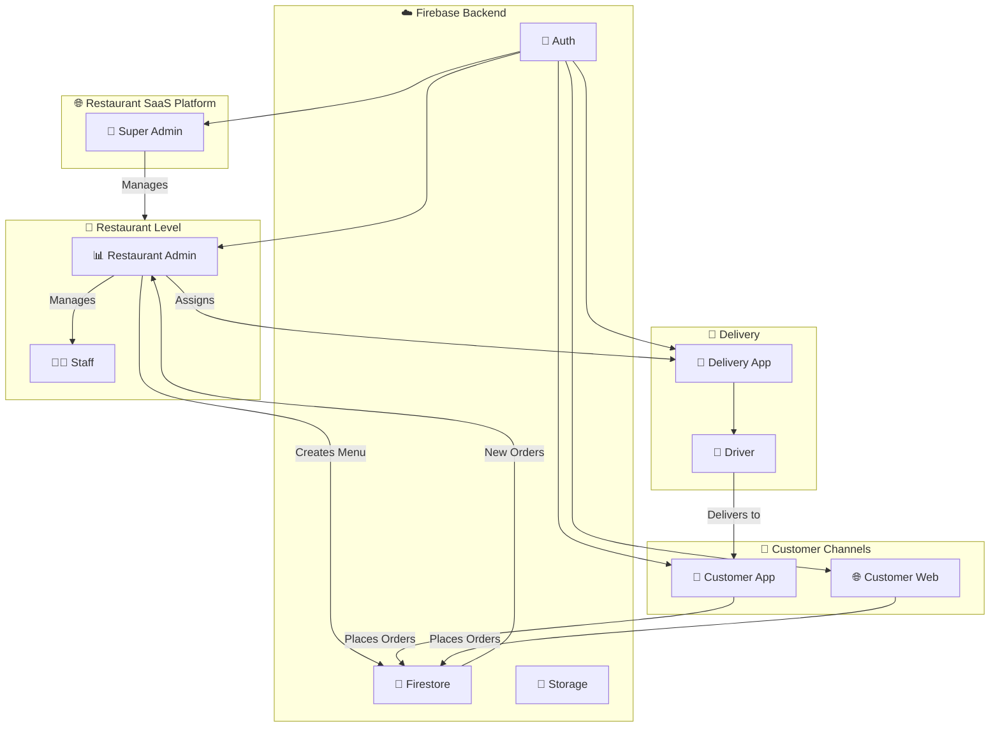
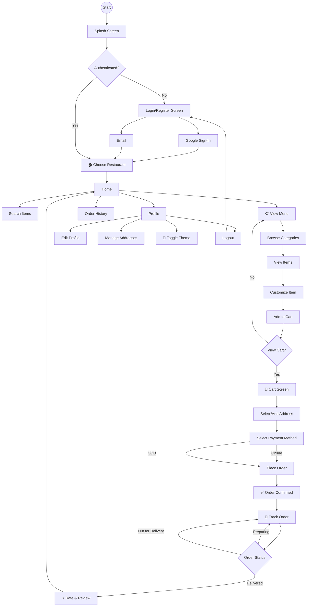
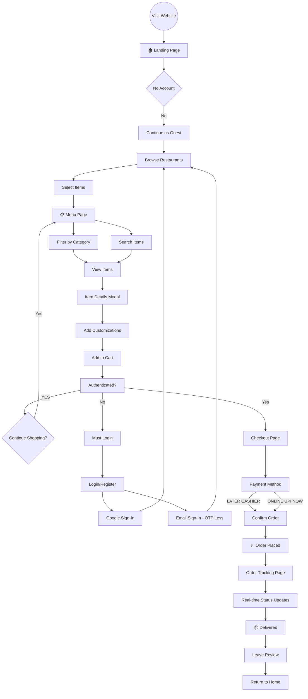
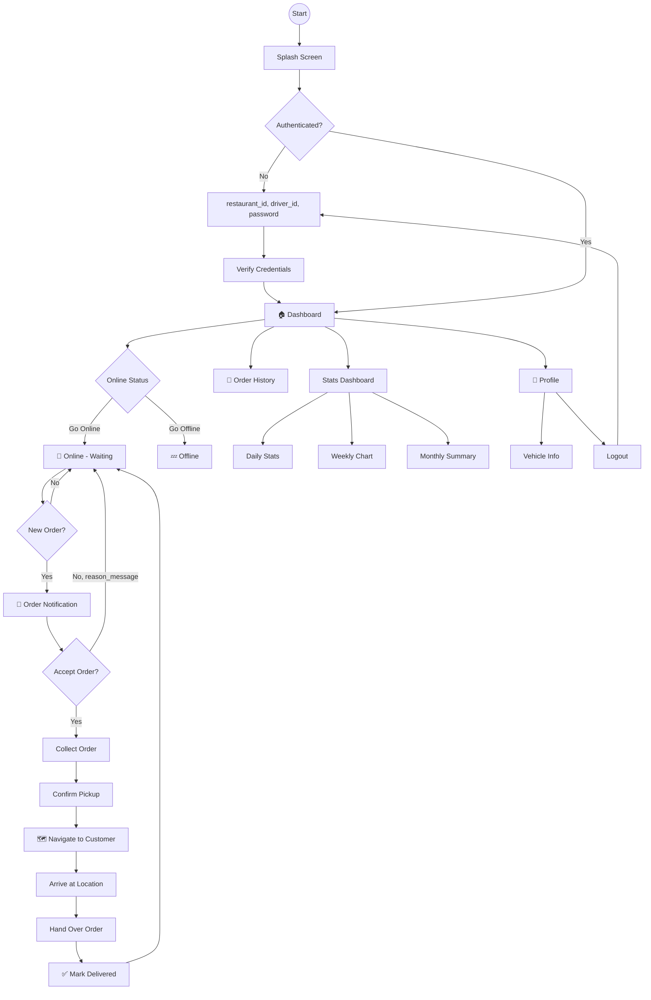
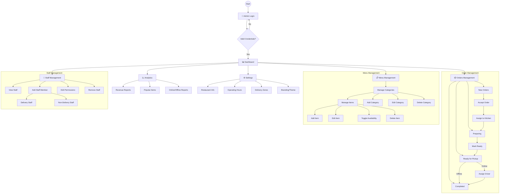
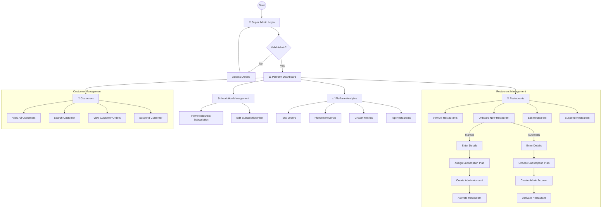
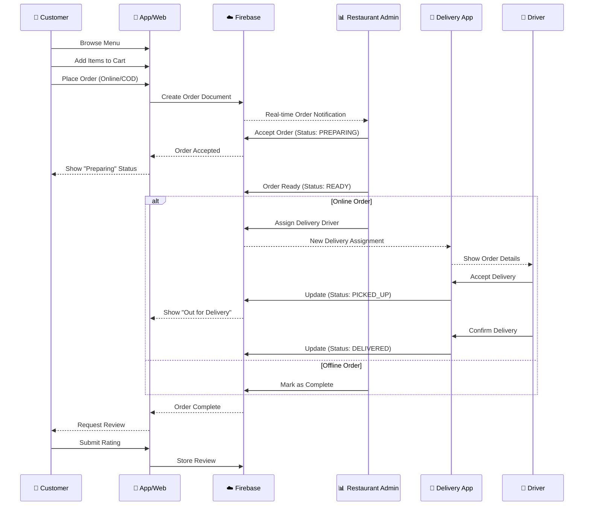

# 🍽️ Restaurant SaaS Platform - Flowcharts

## 1. Overall System Architecture

---

## 2. 📱 Customer App Flowchart

---

## 3. 🌐 Customer Web Flowchart

---

## 4. 🚗 Delivery App Flowchart

---

## 5. 📊 Restaurant Admin Flowchart

---

## 6. 🔧 Super Admin Flowchart

---

## 7. 🔄 Complete Order Flow (End-to-End)

